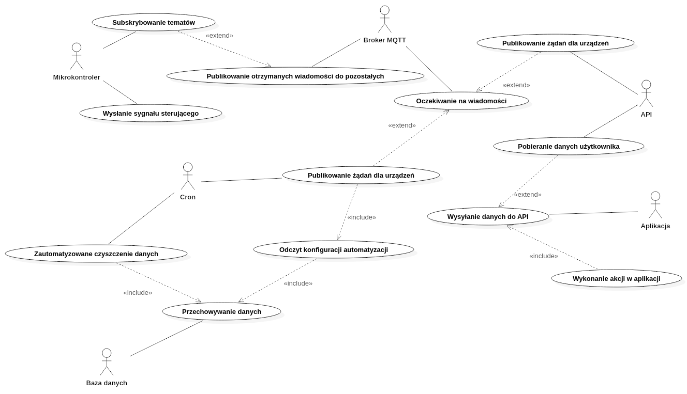

# Opis projektu

<!-- Dokładny opis realizowanego projektu, jego zakres, przykłady zastosowania, planowane funkcjonalności (przypadki użycia), porównanie z istniejącymi rozwiązaniami, itp. -->

Realizowany przez nas projekt zakłada powstanie systemu inteligentnego domu, obsługującego odczyt danych z czujników, jak i sterowanie podłączonymi urządzeniami. Planujemy umożliwienie automatyzacji niektórych czynności, wzorując się na aplikacji IFTTT:

Proponowane przez nas rozwiązanie pozwalałoby na niemal dowolną konfigurację automatyzacji domu, przez ustawienie w pierwszej sekcji (If This) progu dla wartości odczytanej z danego czujnika oraz akcji dla podpiętego urządzenia w sekcji drugiej (Then That).

Zakładamy, że cały system będzie utrzymywany na naszych serwerach. Chcemy jednak dopuścić do użytku urządzenia stworzone przez użytkowników. W związku z tym, przy konfiguracji czujników w aplikacji, użytkownik sam wybierze, jakie dane otrzymuje i na jakich tematach MQTT. Możliwe będzie więc dodanie wielu czujników obsługiwanych przez jedno urządzenie.

Najpopularniejszym rozwiązaniem tego typu jest Google Home, który pozwala na integrację urządzeń obsługiwanych przez inne systemy. Ma jednak ograniczoną ilość rodzajów urządzeń, przez co przykładowo czujnik temperatury i wilgotności musi być dodany jako termostat. Pojawia się wtedy informacja o ustawionym chłodzeniu, chociaż urządzenie w rzeczywistości takiej funkcjonalności nie posiada:

# Podział na moduły

<!-- Podział projektu na moduły oraz interfejsy pomiędzy poszczególnymi modułami. Moduły powinny być tak zaplanowane, żeby reprezentowały dobrze wydzieloną część systemu (nadającą się do powtórnego wykorzystania) i żeby dało się je (w miarę) równolegle implementować. -->

# Literatura

<!-- Badania (research) literatury. Należy znaleźć m.in. artykuły opisujące podobne do planowanego systemu rozwiązania, oraz artykuły przedstawiające problematykę/rozwiązania/implementacje/itp. zagadnień użytecznych z punku widzenia projektowanego systemu (np. modele matematyczne/fizyczne/itp., których można użyć w implementacji projektowanego systemu, zagadnienia dot. przesyłania danych w podobnych systemach, bezpieczeństwa itp.). Należy krótko przedstawić co z danego artykułu zostanie potencjalnie wykorzystane w projektowanym systemie wraz z krótkim uzasadnieniem dlaczego. -->

# Algorytmy wykorzystane w projekcie

<!-- Algorytmy, techniki, prawa fizyczne, wzory, itp. które zostaną wykorzystane. Na przykład jeśli częścią projektu jest symulator to na bazie jakich algorytmów/praw fizycznych będzie on zaimplementowany, jeśli częścią systemu jest optymalizacja/rozpoznawanie czegoś to jakie techniki (np. z zakresu uczenia maszynowego) zostaną zastosowane. -->

# Stos technologiczny

<!-- Planowany stos technologiczny wraz z uzasadnieniem wyboru (oraz alternatywnymi rozwiązaniami, które zostały odrzucone - również z uzasadnieniem) -->

## Mikrokontroler

Docelowa implementacja powstanie w frameworku Arduino (C++). Alternatywą dla naszego sprzętu (ESP8266) jest MicroPython, jednak na korzyść Arduino przemawia spora kolekcja bibliotek do czujników.

Wstępnie zastąpimy fizyczne urządzenia skryptami napisanymi w języku JavaScript lub Python. Oba te języki pozwalają na szybką implementację algorytmu publikowania danych przez MQTT.

## MQTT listener

Implementacja powstanie w języku JavaScript (NodeJS) lub Python. Oba pozwalają na wygodną obsługę MQTT oraz bazy danych.

## API

Zostanie napisane z wykorzystaniem frameworku Symfony w języku PHP 8 wraz z dodatkami PHPStan do analizy statycznej kodu i PHPUnit do testowania kodu. Alternatywą był język Python (frameworki Django oraz Flask).

## Aplikacja

Planujemy stworzyć Single-Page Application, do czego możemy wykorzystać rozmaite frameworki JavaScript, jak AngularJS, React czy Vue.js, jednak nie wykluczamy klasycznej aplikacji z podstronami. W tym wypadku mogłaby to być wspólna aplikacja z API (monolit?), bądź pracująca niezależnie.
