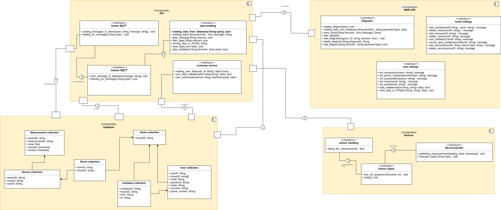

\newpage

# Opis projektu

<!-- Dokładny opis realizowanego projektu, jego zakres, przykłady zastosowania, planowane funkcjonalności (przypadki użycia), porównanie z istniejącymi rozwiązaniami, itp. -->

Realizowany przez nas projekt zakłada powstanie systemu inteligentnego domu, obsługującego odczyt danych z czujników, jak i sterowanie podłączonymi urządzeniami. Planujemy umożliwienie automatyzacji niektórych czynności, wzorując się na aplikacji IFTTT:

Proponowane przez nas rozwiązanie pozwalałoby na niemal dowolną konfigurację automatyzacji domu, przez ustawienie w pierwszej sekcji (If This) progu dla wartości odczytanej z danego czujnika oraz akcji dla podpiętego urządzenia w sekcji drugiej (Then That).

Zakładamy, że cały system będzie utrzymywany na naszych serwerach. Chcemy jednak dopuścić do użytku urządzenia stworzone przez użytkowników. W związku z tym, przy konfiguracji czujników w aplikacji, użytkownik sam wybierze, jakie dane otrzymuje i na jakich tematach MQTT. Możliwe będzie więc dodanie wielu czujników obsługiwanych przez jedno urządzenie.

Po założeniu konta, użytkownik może założyć nowy dom i dodawać do niego pomieszczenia. Może także przyjąć zaproszenie do istniejącego domu, jeżeli zostanie ono wysłane po procesie rejestracji. W domu każdy użytkownik jest równy: może zarządzać pomieszczeniami, urządzeniami oraz domownikami.Użytkownik może też nie przypisywać urządzenia do pomieszczenia w domu - jest ono wtedy widoczne tylko dla niego. Tak samo urządzenie będzie widoczne tylko dla jego właściciela, gdy inny domownik usunie urządzenie z pomieszczenia.

Najpopularniejszym rozwiązaniem tego typu jest Google Home, który pozwala na integrację urządzeń obsługiwanych przez inne systemy. Ma jednak ograniczoną ilość rodzajów urządzeń, przez co przykładowo czujnik temperatury i wilgotności musi być dodany jako termostat. Pojawia się wtedy informacja o ustawionym chłodzeniu, chociaż urządzenie w rzeczywistości takiej funkcjonalności nie posiada.

Trzeba również wspomnieć o Home Assistant, który obsługuje więcej typów urządzeń, a także posiada możliwość ustawiania scen i automatyzacji. Ponieważ jest to projekt open-source, może się też pochwalić ogromnym wsparciem społeczności. Niestety, jest on trudny w konfiguracji.

# Podział na moduły i interfejsy

<!-- Podział projektu na moduły oraz interfejsy pomiędzy poszczególnymi modułami. Moduły powinny być tak zaplanowane, żeby reprezentowały dobrze wydzieloną część systemu (nadającą się do powtórnego wykorzystania) i żeby dało się je (w miarę) równolegle implementować. -->

- Urządzenia
  - Aplikacja bazowa
    - Konfiguracja urządzenia przez Wi-Fi (tryb punktu dostępowego)
    - Usypianie/wybudzanie urządzenia
    - Odczyt danych z czujnika przez bridge (generycznie!)
    - Publikowanie danych do brokera MQTT
  - Biblioteka czujnika (gotowa biblioteka + plik nagłówkowy z informacjami o dostępnych danych)
  - Bridge (wspólny sposób czytania danych z różnych czujników)
- Webapp
  - GUI z pomiarami/wykresami
  - Ustawienia użytkownika (dane kontaktowe, hasło, username, avatar)
  - Ustawienia domu (dodawanie/usuwanie pomieszczeń, tworzenie/anulowanie zaproszeń)
- API
  - Endpointy z aktualnymi pomiarami (REST API - `GET`)
  - Endpointy z historycznymi danymi (REST API - `GET`)
  - Ustawienia użytkownika
  - Ustawienia domu
  - Zadania `cron`
- Baza danych   

# Literatura

<!-- Badania (research) literatury. Należy znaleźć m.in. artykuły opisujące podobne do planowanego systemu rozwiązania, oraz artykuły przedstawiające problematykę/rozwiązania/implementacje/itp. zagadnień użytecznych z punku widzenia projektowanego systemu (np. modele matematyczne/fizyczne/itp., których można użyć w implementacji projektowanego systemu, zagadnienia dot. przesyłania danych w podobnych systemach, bezpieczeństwa itp.). Należy krótko przedstawić co z danego artykułu zostanie potencjalnie wykorzystane w projektowanym systemie wraz z krótkim uzasadnieniem dlaczego. -->

## Artykuły opisujące podobne do planowanego systemu rozwiązania

### Data centre temperature monitoring with ESP8266 based Wireless Sensor Network and cloud based dashboard with real time alert system

Dzięki temu artykułowi dowiadujemy się jak monitorować **temperaturę i wilgotności** w różnych punktach lokalizacji i zrobienie alertu gdy temperatura przekroczy pewną wartość. Rozwiązanie na płytce ESP8266,  Publikowanie danych z czujników w czasie rzeczywistym.

**Wykorzystanie:** W naszym projekcie chcielibyśmy zastosować funkcjonalność monitorowania temperatury i wilgotności. Którą będzie można w łatwy sposób sprawdzić w aplikacji. Artykułu użyliśmy dlatego, że problem został rozwiązany na płytce ESP8266, której używamy w projekcie oraz system alertów, który również chcemy zaimplementować.

Link: https://ieeexplore.ieee.org/document/8073958

### Arduino-based smart irrigation using water flow sensor, soil moisture sensor, temperature sensor and ESP8266 WiFi module
        
Artykuł pokazuje monitorowanie **wilgotności, temperatury** potrzebnych różnym uprawom za pomocą czujników. Dane są zbierane i odbierane przez arduino, które mogą być połączone z interaktywną stroną internetową, która pokazuje wartości w czasie rzeczywistym wraz z wartościami standardowymi różnych czynników wymaganych przez uprawy.
        
**Wykorzystanie:** Kolejny przykład zastosowania monitorowania temperatury i wilgotności. Artykułu użyliśmy dlatego, że problem został rozwiązany na płytce ESP8266 oraz Arduino którego używamy w projekcie.

Link: https://ieeexplore.ieee.org/abstract/document/7906792
        
### Remote Access Weather Monitoring System Based on Soft Real-Time System (SRTS)

Artykuł wykorzystujący działanie **barometru** BMP280. Aplikacja informujące o warunkach pogodowych w czasie rzeczywistym. Dane zebrane są porównywane z danymi z kilku aplikacji prognozujących pogodę w niektórych mediach. ane są przesyłane i przechowywane w bazie danych, a następnie wyświetlane w aplikacji internetowej i mobilnej. Na podstawie tych informacji, użytkownik może uzyskać informacje bezpośrednio w czasie rzeczywistym.

**Wykorzystanie:** W naszej aplikacji chcemy mieć również informację o warunkach w czasie rzeczywistym, w artykule został wykorzystany czujnik BMP280, który posiadamy i chcielibyśmy wykorzystać w projekcie. Oprócz tego, zainteresowało nas samo działanie aplikacji m.in przesyłanie, przechowywanie i przetwarzanie danych.

Link: https://ieeexplore.ieee.org/document/8711997

### Development of a prototype smart home intelligent lighting control architecture using sensors onboard a mobile computing system

W artykule przedstawiono prototyp inteligentnego systemu oświetleniowego. Jest to aplikacja mobilna, która wykorzystywała wbudowany **czujnik światła** otoczenia do uruchomienia algorytmu sprzężenia zwrotnego w pętli zamkniętej w celu wdrożenia zbierania światła dziennego.
        
**Wykorzystanie:** W naszej aplikacji planujemy wykorzystanie czujnika światła.  W artykule został wykorzystany własnie taki czujnik w połączeniu z IoT,  okaże się to pomocne podczas implementacji rozwiązania sterowania roletami w pomieszczeniu.

Link: https://www.sciencedirect.com/science/article/pii/S0378778816319971
        
## Artykuły przedstawiające problematykę, rozwiązania, implementacje i temu podobne zagadnienia użyteczne z punku widzenia projektowanego systemu

### IOT Based on Garbage Monitoring System

Artykuł opisuje projekt systemu do monitorowania poziomu napełnienia śmietników bazujący na urządzeniach IoT. System wykorzystuje dane wygenerowane z czujnika nacisku i na ich podstawie pokazuje status śmietnika w aplikacji webowej. 

**Wykorzystanie:** W naszej aplikacji planujemy wykorzystać czujniki zaprogramowane w Arduino, PHP WebService oraz ESP8266. Rozwiązania przedstawione w artykule w większym stopniu pokrywają się z naszym pomysłem odnośnie wykorzystania czujników w aplikacji. Okaże się to pomocne przy projektowaniu aplikacji webowej oraz zapewnieniu jej komunikacji z danymi wygenerowanymi przez czujniki. 

Link: https://ijsrcseit.com/paper/CSEIT172289.pdf

### ESP8266 based implementation of wireless sensor network with Linux based web-server

Urządzenie IoT - ESP8266 + Apache+ PHP + SQLite3.

**Wykorzystanie:**

Link: https://ieeexplore.ieee.org/abstract/document/7570919

### A Design of Greenhouse Monitoring System Based on Low-Cost Mesh Wi-Fi Wireless Sensor Network

Urządzenie IoT - MongoDB + esp8266, PlatformIO i Arduino

**Wykorzystanie:**

Link: https://ieeexplore.ieee.org/abstract/document/9422655

### IoT based smart home automation system using sensor node

Urządzenie IoT - ESP8266 + Arduino, PHP, temperature

**Wykorzystanie:**

Link: https://ieeexplore.ieee.org/abstract/document/8389037

<!--

# Algorytmy wykorzystane w projekcie

 Algorytmy, techniki, prawa fizyczne, wzory, itp. które zostaną wykorzystane. Na przykład jeśli częścią projektu jest symulator to na bazie jakich algorytmów/praw fizycznych będzie on zaimplementowany, jeśli częścią systemu jest optymalizacja/rozpoznawanie czegoś to jakie techniki (np. z zakresu uczenia maszynowego) zostaną zastosowane. -->

# Stos technologiczny

## Mikrokontroler

Docelowa implementacja powstanie w frameworku Arduino (C++). Alternatywą dla naszego sprzętu (ESP8266) jest MicroPython, jednak na korzyść Arduino przemawia spora kolekcja bibliotek do czujników oraz łatwa implementacja algorytmu. Dodatkowo, skorzystamy z PlatformIO IDE, by przechowywać w projekcie załączane biblioteki oraz zorganizować czytelną strukturę plików.

## MQTT listener

Implementacja powstanie w języku JavaScript (NodeJS) lub Python. Oba pozwalają na wygodną obsługę MQTT oraz bazy danych. Alternatywą może być dowolny inny język programowania, jednak wybór padł na te dwa języki, gdyż są one powszechnie wykorzystywane do pracy z MQTT. Posiadają też wygodne biblioteki do komunikacji z użyciem tego protokołu.

## API

Zostanie napisane z wykorzystaniem frameworku Symfony w języku PHP 8 wraz z dodatkami PHPStan do analizy statycznej kodu i PHPUnit do testowania kodu. Alternatywą był język Python (frameworki Django oraz Flask). Na korzyść PHP przemawia wygoda tworzenia nowych klas (w tym testów), integracja analizy statycznej z IDE oraz możliwość łatwego wygenerowania raportu pokrycia kodu testami.

## Aplikacja

Planujemy stworzyć Single-Page Application, do czego możemy wykorzystać rozmaite frameworki JavaScript, jak AngularJS, React czy Vue.js. Nie zdecydowaliśmy się jeszcze na konkretny framework. Komunikacja z API będzie się odbywać poprzez zapytania w tle (AJAX), z wykorzystaniem biblioteki Axios.

\newpage

# Diagramy przypadków użycia

\newpage

# Diagram interfejsów

